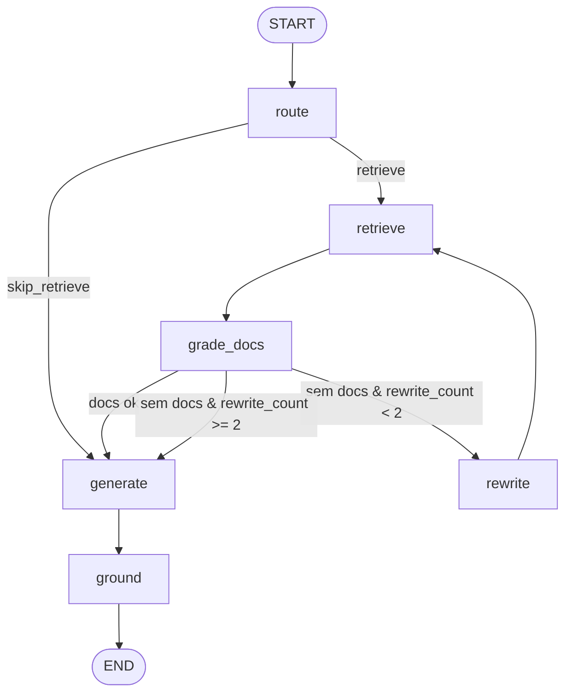

# Cite — Agentic RAG com LangGraph

Pipeline de RAG agêntico que valida relevância de contexto recuperado, reescreve queries ambíguas e checa fundamentação (grounding) antes de responder com citações rastreáveis.

> **Linha de currículo:** Agentic RAG em LangGraph com roteamento condicional, grading/filtragem de documentos recuperados, query rewriting iterativo e verificação de grounding.

## Por que Agentic RAG ≠ similarity + LLM

- **Roteamento prévio:** Perguntas triviais ou fora do corpus evitam recuperação vetorial desnecessária (`skip_retrieve`).
- **Grading de documentos:** Cada chunk recuperado é avaliado para filtrar ruído antes da geração.
- **Reescrita corretiva de query:** Se a busca inicial falhar, o grafo reescreve a pergunta e tenta recuperar novamente (até 2x).
- **Verificação de grounding:** Garante que a resposta final é suportada exclusivamente pelos trechos citados.
- **Estado e checkpointing:** Grafo orquestrado via LangGraph com `MemorySaver`.

## Grafo

Veja o arquivo fonte em [`diagrams/graph.mmd`](diagrams/graph.mmd):



## Setup

```bash
pip install -e .
cp .env.example .env   # GROQ_API_KEY=
# Embeddings: CITE_EMBED=default (ONNX local) ou CITE_EMBED=hf (VM / sentence-transformers)
```

## CLI

```bash
# 1. Ingerir base de documentos
python -m cite ingest

# 2. Fazer perguntas
python -m cite ask "Qual o prazo de reembolso e onde isso está escrito?"
python -m cite ask "Qual o CNPJ da Receita Federal?"
python -m cite ask "O que é RAG?"   # skip_retrieve

# 3. Rodar avaliação
python -m cite eval
```

## Demo (4 comandos)

1. `python -m cite ask "Qual o prazo de reembolso e onde isso está escrito?"` → cita `docs/reembolso.md` (7 dias úteis).
2. `python -m cite ask "Qual o CNPJ da Receita Federal?"` → **recusa** (fora da base; não inventa).
3. `python -m cite ask "O que é RAG?"` → `skip_retrieve`, responde direto.
4. `python -m cite eval` → golden ≥6 casos, threshold ≥70% (última corrida: 6/6).

## Corpus

O corpus em `docs/` é o **KinSolo Handbook**, um conjunto de documentos sintético e propositalmente pequeno para validação determinística de fluxos de RAG.

## Avaliação (Eval)

- Dataset: `eval/golden.json` (≥ 6 casos de teste).
- Métrica: Threshold de acurácia/qualidade de ≥ 70% nos critérios de recuperação e resposta.

## Fora de escopo

- Interface gráfica (UI)
- Desk multi-agente
- Web search externo no nó de geração
